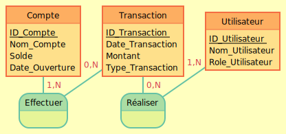

# Module-de-gestion-de-la-comptabilit-

# Dictionnaire de données

| Nom                   | Type         | Description                                         |
|-----------------------|--------------|-----------------------------------------------------|
| ID_Compte             | INT          | Identifiant unique pour chaque compte               |
| Nom_Compte            | VARCHAR(255) | Nom du compte (ex : "Fournisseurs", "Clients")      |
| Solde                 | DECIMAL      | Solde actuel du compte                              |
| Date_Ouverture        | DATE         | Date d'ouverture du compte                          |
| ID_Transaction        | INT          | Identifiant unique pour chaque transaction          |
| Date_Transaction      | DATE         | Date à laquelle la transaction a été réalisée       |
| Montant               | DECIMAL      | Montant de la transaction                           |
| Type_Transaction      | VARCHAR(50)  | Type de la transaction (ex : "Crédit", "Débit")     |


# Modèle Conceptuel de Données (MCD)



- Compte(ID_Compte, Nom_Compte, Solde, Date_Ouverture)
- Transaction(ID_Transaction, Date_Transaction, Montant, Type_Transaction, ID_Compte)

Associations:
- Un Compte peut avoir plusieurs Transactions

# Modèle Logique de Données (MLD)

- Compte(ID_Compte PK, Nom_Compte, Solde, Date_Ouverture)
- Transaction(ID_Transaction PK, Date_Transaction, Montant, Type_Transaction, ID_Compte FK)


# Modèle Physique de Données (MPD)

```sql
CREATE TABLE Compte (
    ID_Compte INT PRIMARY KEY,
    Nom_Compte VARCHAR(255),
    Solde DECIMAL(10, 2),
    Date_Ouverture DATE
);

CREATE TABLE Transaction (
    ID_Transaction INT PRIMARY KEY,
    Date_Transaction DATE,
    Montant DECIMAL(10, 2),
    Type_Transaction VARCHAR(50),
    ID_Compte INT,
    FOREIGN KEY (ID_Compte) REFERENCES Compte(ID_Compte)
);
```
# Jeu de donnée 

-- Insertion des comptes
```sql
INSERT INTO Compte (ID_Compte, Nom_Compte, Solde, Date_Ouverture) VALUES
(1, 'Compte Courant', 10000.00, '2023-01-01'),
(2, 'Compte Épargne', 5000.00, '2023-01-10');
```
-- Insertion des transactions
```sql
INSERT INTO Transaction (ID_Transaction, Date_Transaction, Montant, Type_Transaction, ID_Compte) VALUES
(1, '2023-02-01', 150.00, 'Débit', 1),
(2, '2023-02-02', 200.00, 'Crédit', 2);
```
# Création d'utilisateurs
-- Création d'un utilisateur et attribution des droits
```sql
CREATE USER 'comptaUser'@'localhost' IDENTIFIED BY 'motDePasseFort';
GRANT ALL PRIVILEGES ON baseDeDonneesComptabilite.* TO 'comptaUser'@'localhost';
FLUSH PRIVILEGES;
```

