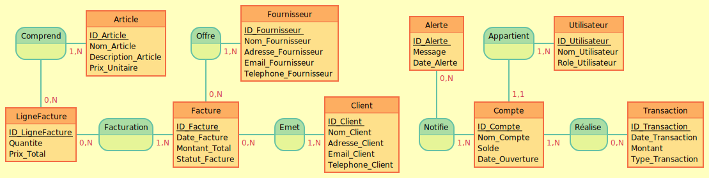

# Module de Gestion de la Comptabilité

## Dictionnaire de données

|-----------------|--------------|-----------------------------------------------------|
| ID_Compte       | INT          | Identifiant unique pour chaque compte               |
| Nom_Compte      | VARCHAR(255) | Nom du compte (ex : "Fournisseurs", "Clients")      |
| Solde           | DECIMAL      | Solde actuel du compte                              |
| Date_Ouverture  | DATE         | Date d'ouverture du compte                          |
| Nom              | Type         | Description                                         |
|------------------|--------------|-----------------------------------------------------|
| ID_Transaction   | INT          | Identifiant unique pour chaque transaction          |
| Date_Transaction | DATE         | Date à laquelle la transaction a été réalisée       |
| Montant          | DECIMAL      | Montant de la transaction                           |
| Type_Transaction | VARCHAR(50)  | Type de la transaction (ex : "Crédit", "Débit")     |
| ID_Compte        | INT          | Identifiant du compte associé                       |
| Nom               | Type         | Description                           |
|-------------------|--------------|---------------------------------------|
| ID_Client         | INT          | Identifiant unique du client          |
| Nom_Client        | VARCHAR(255) | Nom du client                         |
| Adresse_Client    | VARCHAR(255) | Adresse du client                     |
| Email_Client      | VARCHAR(255) | Email du client                       |
| Telephone_Client  | VARCHAR(20)  | Téléphone du client                   |
| Nom                 | Type         | Description                            |
|---------------------|--------------|----------------------------------------|
| ID_Fournisseur      | INT          | Identifiant unique du fournisseur      |
| Nom_Fournisseur     | VARCHAR(255) | Nom du fournisseur                     |
| Adresse_Fournisseur | VARCHAR(255) | Adresse du fournisseur                 |
| Email_Fournisseur   | VARCHAR(255) | Email du fournisseur                   |
| Telephone_Fournisseur| VARCHAR(20) | Téléphone du fournisseur               |
| Nom             | Type         | Description                                  |
|-----------------|--------------|----------------------------------------------|
| ID_Facture      | INT          | Identifiant unique de la facture             |
| Date_Facture    | DATE         | Date de création de la facture               |
| Montant_Total   | DECIMAL      | Montant total de la facture                  |
| ID_Client       | INT          | Identifiant du client associé à la facture   |
| ID_Fournisseur  | INT          | Identifiant du fournisseur (si applicable)   |
| Statut_Facture  | VARCHAR(50)  | Statut de la facture (ex : "Payée", "Non payée") |
| Nom                 | Type         | Description                      |
|---------------------|--------------|----------------------------------|
| ID_Article          | INT          | Identifiant unique de l'article |
| Nom_Article         | VARCHAR(255) | Nom de l'article                |
| Description_Article | TEXT         | Description de l'article        |
| Prix_Unitaire       | DECIMAL      | Prix unitaire de l'article      |
| Nom               | Type         | Description                                       |
|-------------------|--------------|---------------------------------------------------|
| ID_LigneFacture   | INT          | Identifiant unique de la ligne de facture         |
| ID_Facture        | INT          | Identifiant de la facture associée                |
| ID_Article        | INT          | Identifiant de l'article facturé                  |
| Quantite          | INT          | Quantité de l'article                             |
| Prix_Total        | DECIMAL      | Prix total pour la ligne (quantité * prix unitaire) |

## Modèle Conceptuel de Données (MCD)



- La structure exacte du MCD doit être dessinée et sauvegardée en tant qu'image.

- La structure MLD reflète le dictionnaire de données ci-dessus, avec les relations appropriées entre les tables.

## Modèle Physique de Données (MPD)

```sql
CREATE TABLE Compte (
    ID_Compte INT AUTO_INCREMENT PRIMARY KEY,
    Nom_Compte VARCHAR(255) NOT NULL,
    Solde DECIMAL(15, 2) NOT NULL,
    Date_Ouverture DATE NOT NULL,
    ID_Utilisateur INT,
    FOREIGN KEY (ID_Utilisateur) REFERENCES Utilisateur(ID_Utilisateur)
);

CREATE TABLE Transaction (
    ID_Transaction INT AUTO_INCREMENT PRIMARY KEY,
    Date_Transaction DATE NOT NULL,
    Montant DECIMAL(15, 2) NOT NULL,
    Type_Transaction VARCHAR(50) NOT NULL,
    ID_Compte INT NOT NULL,
    FOREIGN KEY (ID_Compte) REFERENCES Compte(ID_Compte)
);

CREATE TABLE Client (
    ID_Client INT AUTO_INCREMENT PRIMARY KEY,
    Nom_Client VARCHAR(255) NOT NULL,
    Adresse_Client VARCHAR(255),
    Email_Client VARCHAR(255),
    Telephone_Client VARCHAR(20)
);

CREATE TABLE Fournisseur (
    ID_Fournisseur INT AUTO_INCREMENT PRIMARY KEY,
    Nom_Fournisseur VARCHAR(255) NOT NULL,
    Adresse_Fournisseur VARCHAR(255),
    Email_Fournisseur VARCHAR(255),
    Telephone_Fournisseur VARCHAR(20)
);

CREATE TABLE Facture (
    ID_Facture INT AUTO_INCREMENT PRIMARY KEY,
    Date_Facture DATE NOT NULL,
    Montant_Total DECIMAL(15, 2) NOT NULL,
    ID_Client INT,
    ID_Fournisseur INT,
    Statut_Facture VARCHAR(50) NOT NULL,
    FOREIGN KEY (ID_Client) REFERENCES Client(ID_Client),
    FOREIGN KEY (ID_Fournisseur) REFERENCES Fournisseur(ID_Fournisseur)
);

CREATE TABLE Article (
    ID_Article INT AUTO_INCREMENT PRIMARY KEY,
    Nom_Article VARCHAR(255) NOT NULL,
    Description_Article TEXT,
    Prix_Unitaire DECIMAL(10, 2) NOT NULL
);

CREATE TABLE LigneFacture (
    ID_LigneFacture INT AUTO_INCREMENT PRIMARY KEY,
    ID_Facture INT NOT NULL,
    ID_Article INT NOT NULL,
    Quantite INT NOT NULL,
    Prix_Total DECIMAL(15, 2) NOT NULL,
    FOREIGN KEY (ID_Facture) REFERENCES Facture(ID_Facture),
    FOREIGN KEY (ID_Article) REFERENCES Article(ID_Article)
);
CREATE TABLE IF NOT EXISTS Alerte (
    ID_Alerte INT AUTO_INCREMENT PRIMARY KEY,
    ID_Compte INT NOT NULL,
    Message VARCHAR(255) NOT NULL,
    Date_Alerte TIMESTAMP DEFAULT CURRENT_TIMESTAMP,
    FOREIGN KEY (ID_Compte) REFERENCES Compte(ID_Compte) ON DELETE CASCADE
);
```

```sql
-- Comptes
INSERT INTO Compte (Nom_Compte, Solde, Date_Ouverture, ID_Utilisateur) VALUES
('Nom du Compte 1', 1000.00, '2023-01-01', 1),
('Nom du Compte 2', 500.00, '2023-01-02', 1),
('Nom du Compte 3', 200.00, '2023-01-03', 1);

-- Transactions
INSERT INTO Transaction (Date_Transaction, Montant, Type_Transaction, ID_Compte) VALUES
('2023-02-01', -150.00, 'Débit', 1),
('2023-02-02', 200.00, 'Crédit', 1);

-- Clients
INSERT INTO Client (Nom_Client, Adresse_Client, Email_Client, Telephone_Client) VALUES
('Entreprise X', '123 rue de l\'entreprise', 'contact@entreprisex.com', '0123456789');

-- Fournisseurs
INSERT INTO Fournisseur (Nom_Fournisseur, Adresse_Fournisseur, Email_Fournisseur, Telephone_Fournisseur) VALUES
('Fournisseur Y', '456 avenue du fournisseur', 'info@fournisseury.com', '9876543210');

-- Factures
INSERT INTO Facture (Date_Facture, Montant_Total, ID_Client, Statut_Facture) VALUES
('2023-03-01', 1500.00, 1, 'Payée');

-- Articles
INSERT INTO Article (Nom_Article, Description_Article, Prix_Unitaire) VALUES
('Article Z', 'Un article très demandé', 50.00);

-- Lignes de Facture
INSERT INTO LigneFacture (ID_Facture, ID_Article, Quantite, Prix_Total) VALUES
(1, 1, 30, 1500.00);
-- Alerte
INSERT INTO Alerte (ID_Compte, Message) VALUES
(1, 'Découvert provoqué par une nouvelle transaction'),
(2, 'Découvert provoqué par une nouvelle transaction'),
(3, 'Découvert provoqué par une nouvelle transaction');
```

-- Création d'un utilisateur et attribution des droits
```sql
CREATE USER 'comptaUser'@'localhost' IDENTIFIED BY 'motDePasseFort';
GRANT ALL PRIVILEGES ON baseDeDonneesComptabilite.* TO 'comptaUser'@'localhost';
FLUSH PRIVILEGES;
```
